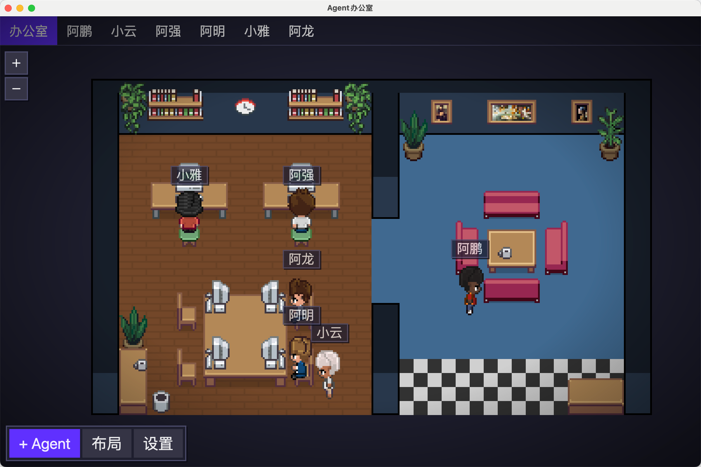

<h1 align="center">
    <a href="https://github.com/LouisEleven/pixel-agents-electron">
        
    </a>
</h1>

<h2 align="center" style="padding-bottom: 20px;">
  The game interface where AI agents build real things
  <br/>
  AI 智能体真正干活的游戏化界面
</h2>

<div align="center" style="margin-top: 25px;">

[](LICENSE)

</div>

<div align="center">
<a href="CHANGELOG.md">📋 Changelog</a> • <a href="docs/product-ideas.md">🧠 Product Ideas</a>
</div>

<br/>

<div align="center">
<a href="#中文">中文</a> | <a href="#english">English</a>
</div>

<br/>

## 中文

`pixel-agents-electron` 是一个独立的 Electron 桌面应用，用像素办公室的方式可视化和管理 AI agents。每个 agent 都会变成办公室里的角色：会移动、会坐到工位、会根据当前行为展示状态——写代码时打字、搜索文件时阅读、等待你处理时停下来。

这个项目已经不再以 VS Code 插件为主要形态，而是聚焦在独立桌面端体验，适合直接运行、打包和分发 Electron 应用。

本项目基于另一个作者的优秀开源项目二次开发，特别感谢原项目作者：<https://github.com/pablodelucca/pixel-agents>。



## 功能特性

- **一个 Agent，一个角色** —— 每个 Claude Code 会话都会变成办公室里的独立角色
- **实时行为反馈** —— 角色会随着真实工作状态变化，写代码会打字，读文件会阅读，执行命令也会有对应表现
- **内置办公室编辑器** —— 直接在应用里调整地板、墙体和家具布局
- **等待状态提示** —— 当 agent 等待输入或等待授权时，会用气泡等形式提示出来
- **可选声音提醒** —— agent 一轮工作结束时可以播放提示音
- **子 Agent 可视化** —— Task 工具创建的子 agent 会以临时角色形式出现在办公室里，并和父角色关联
- **布局持久化** —— 办公室布局会保存在本地，下次打开应用时自动恢复
- **支持外部素材目录** —— 可以从你电脑上的任意目录加载自定义或第三方家具素材包
- **多样角色形象** —— 当前内置 6 种不同角色形象，基于 [JIK-A-4, Metro City](https://jik-a-4.itch.io/metrocity-free-topdown-character-pack) 的优秀作品制作

<p align="center">
  
</p>

## 环境要求

- 已安装并配置 [Claude Code CLI](https://docs.anthropic.com/en/docs/claude-code)
- 支持平台：macOS、Windows、Linux

## 快速开始

如果你想直接运行这个独立 Electron 应用，可以按下面步骤开始：

```bash
git clone https://github.com/LouisEleven/pixel-agents-electron.git
cd pixel-agents-electron
npm install
cd webview-ui && npm install && cd ..
cd app && npm install && cd ..
cd app && npm run dev
```

如果你想打包桌面应用：

```bash
cd app
npm run dist:mac
npm run dist:win
```

## 使用方式

1. 在桌面应用里打开 **Pixel Agents** 面板
2. 点击 **+ Agent**，创建一个新的 Claude Code 会话，以及它对应的办公室角色
3. 如果你想跳过工具授权提示，可以右键 **+ Agent**，使用 `--dangerously-skip-permissions` 启动
4. 开始和 Claude 一起工作，角色会根据行为实时变化
5. 点击角色后，再点击座位，就可以分配或移动它的位置
6. 点击 **Layout** 进入办公室编辑器，自定义你的空间布局

## 布局编辑器

内置编辑器可以让你自由设计和调整办公室：

- **地板** —— 支持完整的 HSB 颜色控制
- **墙体** —— 支持自动拼接和颜色自定义
- **工具** —— 包含选择、绘制、擦除、放置、吸管、拾取等操作
- **撤销 / 重做** —— 支持最多 50 步，快捷键为 `Ctrl+Z` / `Ctrl+Y`
- **导出 / 导入** —— 可以通过设置面板将布局保存或分享为 JSON 文件

网格最大可以扩展到 `64×64`。点击当前布局外侧的幽灵边框，就可以继续扩展办公室。

### 办公室素材

所有办公室素材——包括家具、地板和墙体——都已经 **完全开源**，并包含在仓库的 `webview-ui/public/assets/` 目录下。开箱即用，不需要额外购买或导入。

每个家具都有自己独立的文件夹，位于 `assets/furniture/` 下，并包含一个 `manifest.json`，用于描述它的精灵图、旋转分组、状态分组（`on` / `off`）以及动画帧。地板贴图以单独 PNG 文件形式存放在 `assets/floors/`，墙体贴图则位于 `assets/walls/`。这种结构让整个素材系统保持模块化，也更方便扩展，而不需要改动应用代码。

如果你想添加新的家具，只需要在 `webview-ui/public/assets/furniture/` 下创建一个文件夹，放入 PNG 素材和 `manifest.json`，然后重新构建应用即可。`scripts/asset-manager.html` 还提供了一个可视化素材管理器，方便创建和编辑 manifest。

如果你想从外部目录加载家具素材，可以打开 **Settings** → **Add Asset Directory**。完整格式和第三方素材包使用方式见 `docs/external-assets.md`。

角色素材基于 [JIK-A-4, Metro City](https://jik-a-4.itch.io/metrocity-free-topdown-character-pack) 的优秀作品制作。

## 工作原理

`pixel-agents-electron` 会监听 Claude Code 的 JSONL transcript 文件，追踪每个 agent 当前在做什么。当 agent 调用工具，比如写文件、读取内容或运行命令时，桌面应用会实时更新角色动画和状态展示。整个过程不需要改动 Claude Code 本身。

前端界面运行的是一个轻量级 canvas 游戏循环，包含渲染、寻路和角色状态机（`idle → walk → type/read`），以像素风方式实时表现 agent 的活动。

## 技术栈

- **桌面应用**：Electron、TypeScript、`node-pty`、`electron-builder`
- **界面层**：React 19、TypeScript、Vite、Canvas 2D
- **共享逻辑**：TypeScript、Claude transcript 解析、素材加载、持久化存储

## 已知限制

- **Agent 和终端的同步还在持续打磨** —— 当前 agent 与 Claude Code 终端实例之间的关联还不算绝对稳定，在终端频繁打开、关闭或恢复时，偶尔会出现不同步
- **状态判断部分依赖启发式逻辑** —— Claude Code 的 JSONL transcript 格式并不总是提供明确的“等待输入”或“本轮完成”信号，因此部分状态切换需要结合计时器和行为模式推断
- **项目目录默认值可能让人意外** —— 在 Linux 和 macOS 上，如果你启动应用时没有先选择项目目录，agent 可能会直接在你的 home 目录启动；这是被支持的，transcript 仍会记录在 `~/.claude/projects/` 下

## 故障排查

如果某个 agent 看起来一直 idle，或者根本没有出现：

1. **Debug View** —— 打开应用设置并启用 **Debug View**，可以查看每个 agent 的 JSONL 文件状态、已解析行数、最后活动时间戳以及文件路径；如果看到 `JSONL not found`，说明应用还没有定位到该会话的 transcript 文件
2. **日志** —— 如果你是从源码运行，请查看 Electron 应用日志中带有 `[Pixel Agents]` 的消息，重点关注项目目录解析、JSONL 轮询、路径不匹配以及无法识别的 transcript 记录类型

## 未来方向

这个项目长期想做的是一种界面：管理 AI agents 像在玩《模拟人生》，但它们做出来的东西都是真实可交付的。

- **Agents 作为可见的同事** —— 你可以看到、分配、监控、打断和重定向它们，每个角色都有自己的职责、工具、状态和上下文消耗
- **工位就是工作目录** —— 把 agent 拖到某张桌子上，就等于把它分配到某个项目或工作空间
- **办公室就是项目中枢** —— 比如墙上挂着一个看板，空闲 agent 可以自己去认领任务
- **更深的 agent 可观察性** —— 点击任意角色，就能看到它使用的模型、分支、system prompt 和完整工作历史，并随时和它对话或重新指派工作
- **把 token 状态游戏化** —— 速率限制、上下文窗口等信息，也可以像游戏资源条一样可视化
- **完全可定制** —— 角色、办公室主题和素材包都可以替换，未来甚至可能从像素风扩展到 3D 或 VR

为了支持这些方向，整体架构需要在每一层都保持模块化：

- **平台无关** —— 今天是 Electron 桌面应用，未来也可以扩展到 Web 或其他宿主环境
- **Agent 无关** —— 今天支持 Claude Code，未来也可以通过可组合适配器支持 Codex、OpenCode、Gemini、Cursor、Copilot 等
- **主题无关** —— 社区创作的素材、皮肤和视觉风格都应该自然接入这个系统

我们正在持续打磨核心运行时和适配器架构，让这件事一步步变成现实。

## 产品思路

- 查看 `docs/product-ideas.md` 获取一份中英双语的产品方向与玩法构想。

---

## English

`pixel-agents-electron` is a standalone Electron desktop app that turns AI agents into characters inside a pixel-art office. Every agent appears as a little coworker in your workspace: walking around, sitting down, typing when it writes code, reading when it searches files, and stopping when it is waiting for you.

This project is no longer centered around the VS Code extension form. It is now focused on the standalone desktop experience, making it easier to run directly, package, and distribute as a real desktop app.

This project is a derivative work based on another author's excellent open-source project. Special thanks to the original creator: <https://github.com/pablodelucca/pixel-agents>.


## Features

- **One agent, one character** — every Claude Code session becomes its own animated office character
- **Live activity feedback** — characters respond to real work in progress, such as writing, reading, and running commands
- **Built-in office editor** — customize your workspace with floors, walls, and furniture inside the app
- **Waiting indicators** — speech bubbles make it clear when an agent is waiting for input or permission
- **Optional sound cues** — play a chime when an agent finishes a turn
- **Sub-agent presence** — Task tool sub-agents appear as temporary characters connected to their parent
- **Saved layouts** — office layouts are stored locally and restored the next time you open the app
- **External asset support** — load custom or third-party furniture packs from any folder on your machine
- **A diverse cast of characters** — includes 6 character styles based on the amazing work of [JIK-A-4, Metro City](https://jik-a-4.itch.io/metrocity-free-topdown-character-pack).

<p align="center">
  
</p>

## Requirements

- [Claude Code CLI](https://docs.anthropic.com/en/docs/claude-code) is installed and configured
- Supported platforms: macOS, Windows, and Linux

## Getting Started

If you want to run the standalone Electron app directly on your machine, start with:

```bash
git clone https://github.com/LouisEleven/pixel-agents-electron.git
cd pixel-agents-electron
npm install
cd webview-ui && npm install && cd ..
cd app && npm install && cd ..
cd app && npm run dev
```

If you want to package the desktop app for distribution:

```bash
cd app
npm run dist:mac
npm run dist:win
```

## Usage

1. Open the **Pixel Agents** panel in the desktop app
2. Click **+ Agent** to create a new Claude Code session and its matching office character
3. Right-click **+ Agent** if you want to launch with `--dangerously-skip-permissions` and bypass tool approval prompts
4. Start working with Claude and watch the character react in real time
5. Click a character to select it, then click a seat to assign or move it
6. Click **Layout** to open the office editor and customize your space

## Layout Editor

The built-in editor lets you design and adjust your office however you like:

- **Floor** — full HSB color control
- **Walls** — auto-tiling walls with customizable colors
- **Tools** — select, paint, erase, place, eyedropper, and pick
- **Undo/Redo** — up to 50 steps with `Ctrl+Z` / `Ctrl+Y`
- **Export/Import** — save and share layouts as JSON through the Settings modal

The grid can be expanded up to `64×64` tiles. Click the ghost border outside the current layout to grow the office.

### Office Assets

All office assets — including furniture, floors, and walls — are **fully open-source** and included in this repository under `webview-ui/public/assets/`. There is nothing extra to purchase or import before getting started.

Each furniture item lives in its own folder under `assets/furniture/` and includes a `manifest.json` describing its sprites, rotation groups, state groups (`on` / `off`), and animation frames. Floor tiles are stored as individual PNG files in `assets/floors/`, and wall tile sets live in `assets/walls/`. This structure keeps the asset system modular and easy to extend without changing application code.

To add a new furniture item, create a folder inside `webview-ui/public/assets/furniture/`, place your PNG sprite files there, add a `manifest.json`, and rebuild the app. The asset manager at `scripts/asset-manager.html` provides a visual interface for creating and editing manifests.

To load furniture from an external directory, open **Settings** → **Add Asset Directory**. See `docs/external-assets.md` for the complete manifest format and instructions for using third-party asset packs.

Character sprites are based on the amazing work of [JIK-A-4, Metro City](https://jik-a-4.itch.io/metrocity-free-topdown-character-pack).

## How It Works

`pixel-agents-electron` watches Claude Code JSONL transcript files to understand what each agent is doing right now. When an agent uses tools such as writing files, reading content, or running commands, the desktop app updates that character's animation and status in real time. It works alongside Claude Code without requiring any modification to Claude Code itself.

The UI is powered by a lightweight canvas game loop with rendering, pathfinding, and a character state machine (`idle → walk → type/read`) so agent activity is presented in a lively pixel-art form.

## Tech Stack

- **Desktop app**: Electron, TypeScript, `node-pty`, `electron-builder`
- **Webview/UI**: React 19, TypeScript, Vite, Canvas 2D
- **Shared logic**: TypeScript, Claude transcript parsing, asset loading, persistence

## Known Limitations

- **Agent-terminal sync is still evolving** — the link between agents and Claude Code terminal instances is not yet perfectly robust, and can occasionally drift out of sync when terminals are opened, closed, or restored quickly
- **Status detection is partly heuristic** — Claude Code's JSONL transcript format does not always expose explicit signals for waiting states or turn completion, so some transitions are inferred from timers and activity patterns
- **Project directory defaults can surprise you** — on Linux and macOS, if you launch the app without choosing a project folder first, agents may start in your home directory; this is supported and transcripts are still tracked under `~/.claude/projects/`

## Troubleshooting

If an agent looks stuck on idle or fails to appear:

1. **Debug View** — open app settings and enable **Debug View** to inspect each agent's JSONL file status, parsed lines, last activity timestamp, and file path; if you see `JSONL not found`, the app has not located that session transcript yet
2. **Logs** — when running from source, check the Electron app logs for `[Pixel Agents]` messages related to project directory resolution, JSONL polling, path mismatches, or unrecognized transcript record types

## Where This Is Going

The long-term vision is an interface where managing AI agents feels a bit like playing *The Sims* — except the things being built are real.

- **Agents as visible coworkers** — characters you can watch, assign, monitor, interrupt, and redirect, each with their own role, tools, stats, and context usage
- **Desks as working directories** — drag an agent to a desk to assign it to a project or workspace
- **An office as a project hub** — imagine a room with a Kanban board on the wall where idle agents can pick up tasks on their own
- **Deeper agent inspection** — click any character to view its model, branch, system prompt, and work history, then chat with it or redirect its work
- **Token health as game feedback** — rate limits and context windows shown like in-game resource bars
- **Full customization** — swap in your own characters, office themes, and asset packs, and maybe someday move beyond pixel art into 3D or VR

To support that future, the architecture needs to stay modular at every layer:

- **Platform-agnostic** — Electron desktop app today, with room for web or other host environments later
- **Agent-agnostic** — Claude Code today, with the possibility of supporting Codex, OpenCode, Gemini, Cursor, Copilot, and more through composable adapters
- **Theme-agnostic** — community-made assets, skins, and visual styles should all fit naturally into the system

We are continuing to refine the core runtime and adapter architecture to move in that direction.

## Product Notes

- See `docs/product-ideas.md` for a bilingual product direction and feature ideas document.

## Community & Contributing

- Repository: <https://github.com/LouisEleven/pixel-agents-electron>
- Product notes: `docs/product-ideas.md`
- Contribution guide: `CONTRIBUTING.md`
- Code of conduct: `CODE_OF_CONDUCT.md`

## License

This project is licensed under the [MIT License](LICENSE).
